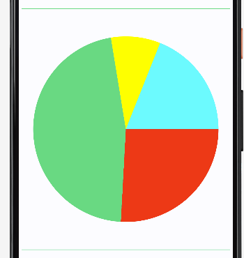

# JetChart
[](https://jitpack.io/#fracassi-marco/JetChart)

A Jetpack Compose library for creating beautiful and interactive charts.

The library supports a wide variety of chart types, including bar charts, line charts, pie chart, donut charts, gauge chart...

Charts can be customized to match your app's style, and they can be animated to provide a more engaging user experience.

Charts can be created in a declarative way, which makes it easy to update them as your data changes.

The library is open source, and it is available on GitHub.

## Key features:
* Supports a wide variety of chart types
* Easy to use
* Declarative API
* Open source
* Visualize data in a clear and concise way
* Engage users with interactive charts
* Make your app more visually appealing

## Use cases:
* Financial apps
* Analytics apps
* Educational apps
* Sports and fitness tracker apps
* Any app that needs to visualize data

## Gradle setup
1. Add the JitPack repository to your build file 
```groovy
allprojects {
    repositories {
        ...
        maven { url 'https://jitpack.io' }
    }
}
```
2. Add the dependency
```groovy
dependencies {
    implementation 'com.github.fracassi-marco:JetChart:1.3.0'
}
```

## Bar Chart


### Features
You can:
- scroll horizontally
- show values inside or above the bar
- define for each bar an action on the tap event
- customize colors and sizes
- define custom x-axis labels
- show or hide y-axis values
- animate the drawing

### Example
```kotlin
@Composable
fun BarChartComposable(text: MutableState<String>) {
    val numberOfBars = 8
    val width = numberOfBars * 80
    BarChart(chars = Bars(
        bars = (1..numberOfBars).map {
            Bar(label = "BAR$it", value = Random.nextFloat(), color = JetGreen) {
                    bar -> text.value = "You clicked on the bar ${bar.label}!"
            }
        }),
        modifier = Modifier.horizontalScroll(rememberScrollState()).width(width.dp).height(500.dp),
        animation = fadeInAnimation(3000),
        xAxisDrawer = BarXAxisDrawer(),
        yAxisDrawer = BarYAxisWithValueDrawer(),
        labelDrawer = SimpleLabelDrawer(),
        valueDrawer = SimpleValueDrawer(drawLocation = Inside)
    )
}
```

## Line Chart


### Features
You can:
- scroll horizontally
- draw multiple lines
- chose how to draw points (none, filled circle or empty circle)
- show lines shading (transparent, solid or gradient)
- define for each point an action on the tap event (TODO)
- customize colors and sizes
- define custom x-axis labels
- show or hide y-axis values
- animate the drawing

### Example
```kotlin
@Composable
fun LineChartComposable() {
    LineChart(lines = listOf(
        Line(points = points(10), lineDrawer = SolidLineDrawer(thickness = 8.dp, color = Blue)),
        Line(points = points(15), lineDrawer = SolidLineDrawer(thickness = 8.dp, color = Red))),
        modifier = Modifier
            .horizontalScroll(rememberScrollState())
            .width(1000.dp)
            .height(500.dp),
        animation = fadeInAnimation(3000),
        pointDrawer = FilledPointDrawer(),
        xAxisDrawer = LineXAxisDrawer(),
        yAxisDrawer = LineYAxisWithValueDrawer(),
        horizontalOffsetPercentage = 1f,
        lineShader = GradientLineShader(listOf(JetGreen, Transparent))
    )
}

@Composable
private fun points(count: Int) = (1..count).map { Point(Random.nextFloat(), "Point$it") }
```

## Pie Chart
  

### Features
You can:
- specify thickness to obtain a pie or a donut chart
- animate the drawing

### Example
```kotlin
@Composable
fun PieChartComposable() {
    PieChart(pies = Pies(listOf(Slice(35f, Red), Slice(45f, JetGreen), Slice(15f, Yellow), Slice(5f, Cyan))),
        modifier = Modifier.height(340.dp),
        animation = fadeInAnimation(4000),
        sliceDrawer = FilledSliceDrawer(thickness = 60f)
    )
}
```

## Gauge Chart


### Features
You can:
- customize the pointer
- customize the arc
- animate the drawing

### Example
```kotlin
@Composable
fun GaugeChartComposable() {
    GaugeChart(
        percentValue = 72f, //between 0 and 100
        modifier = Modifier.padding(horizontal = 16.dp).fillMaxWidth(),
        animation = fadeInAnimation(4000),
        pointerDrawer = NeedleDrawer(needleColor = JetGreen, baseSize = 12.dp),
        arcDrawer = GaugeArcDrawer(thickness = 32.dp, cap = StrokeCap.Round)
    )
}
```